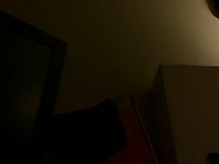
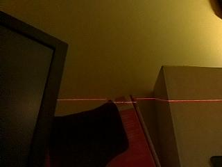
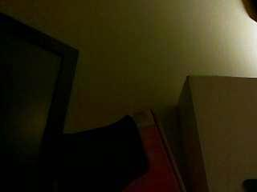
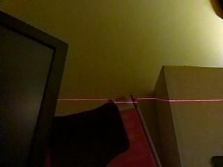
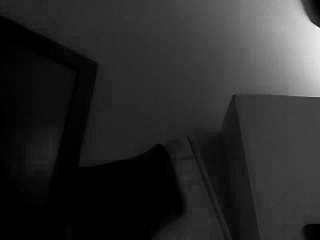
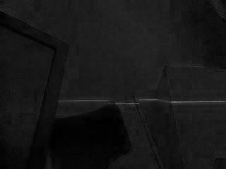
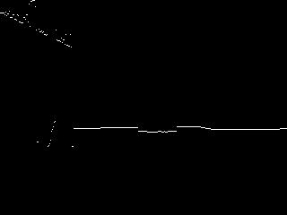
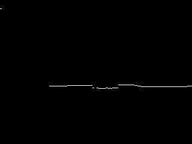

# laser-range-finder
Calculates distance using images taken with a generic webcam and a low-power laser

# Overview

This package implements a Python class that calculates distance from the camera given two images taken by the camera, where one image contains a laser line projection parallel to the camera's focal plane and the other image contains no laser projection.

This method is very similar to the approach described [here](https://sites.google.com/site/todddanko/home/webcam_laser_ranger), although it has been extended to apply to a line instead of a single point.

# Installation

Recommended installation is via pip (preferrably inside a virtualenv):

    pip install laser_range_finder

# Usage

Before you can use the class, you'll need to calibrate your camera. Calculate your camera's:

* vertical field of view in degrees
* horizontal field of view in degrees
* distance between camera center and laser center in millimeters
* radian offset

Then, pass these values when you instantiate the class:

    from laser_range_finder import LaserRangeFinder
    lrf = LaserRangeFinder(vert_fov_deg=50, horz_fov_deg=40, ro=0.01, h=30)

The package is agnostic to how the images are captured, but assumes you can provide them as either a filename or as a PIL Image instance:

    distances = lrf.get_distance(off_img='~/laser-off.png', on_img='~/laser-on.png')

The value returned by `get_distance()` will be a list equal in length to the pixel width of the source images and each element will be the estimated distance from the camera in millimeters. A value of -1 indicates that no reliable distance measurement could be made in the associated column.

If you don't need the specificity of a per-pixel distance measurement, but just want a more general estimate of distance in N blocks across the image, then you can pass these distances to the function `compress_list(lst, bins)`:

    from laser_range_finder.utils import compress_list
    distances = lrf.get_distance(off_img='~/laser-off.png', on_img='~/laser-on.png')
    distances = compress_list(distances, bins=10)

# Methodology

The method assumes we start with two images, a reference image A known to contain no laser line, and an image B that definitely contains a laser line but possibly distorted. We could potentially just use the single image containing the laser line, but have a negative image greatly helps us remove noise. So we start with the following samples images:

 

Notice that the brightness differs considerably between the two images. Later, we'll want to isolate the laser line by finding the difference between the two images, but this difference in overall brightness will interfere with that. So we fix this by using `utils.normalize()` giving us:

 

Since these images are RGB, but the laser is red, we remove some noise by stripping out the blue and green channels using `utils.only_red()` giving us:

 

Now we calculate the difference of the images. If the only change between the images was the laser line, then the resulting image should be completely black with the laser appearing as bright white. In practice, there will still be considerable noise, but the difference will eliminate most of that, giving us:

Finally, we make a "best guess" as to where the laser line is. Since we know the line will be roughly horizontal and the laser line should now correspond to the brightest pixels in the image, we scan each column and find the rows with the brightest pixel, giving us:

Notice the estimate is pretty close, but there's still has some noise, mostly on the left-hand side of the image where the laser line is absorbed by a matte black finish. We fix this by calculating the line's mean and standard deviation brightness, and ignore anything that's less than `mean - stddev`, giving us:

That's removed a lot of the noise, but notice there's still a little left in the top of the image. For this setup, the laser was positions below the camera, which means that the line should never appear above the middle row, so can assume any laser line pixels detected above the middle row are noise. That gives us our final image, which almost perfectly detects the laser projection:

We can then use a little trigonometry to convert the white pixel's offset from the middle row into a physical distance of the laser projection.

For reference, the source images used in this example were captured with a 5MP NoIR camera connected to a Raspberry Pi 2 and a 1mW 3V red laser line diode mounted 22.5 mm from the camera and controlled directly from a Raspberry Pi GPIO pin.
